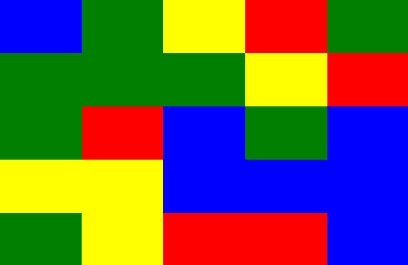
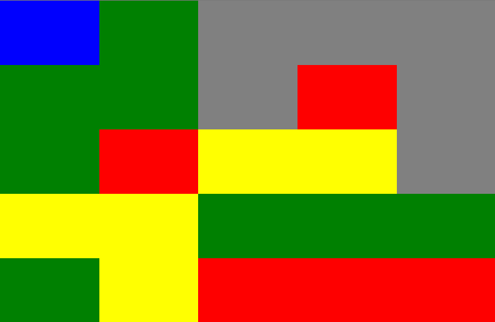

# Blocky Puzzle

## To get started

You will need a recent version of [Node]. If you do not have it installed already, we find [nvm] to be a handy script to install and even juggle between versions of Node without hassle.

On most projects, we have transitioned into using [Yarn], Facebook's package manager, in favour of npm. Either one will do to install and run this project, as well as run its tests.

```sh
yarn
# or `npm install`
yarn start
# or `npm start`
```

`http://localhost:9100/` will open automatically on the blocky app, live-reloading as you develop.

Use `yarn test` to run the unit tests on the terminal. `yarn test --watch` will only run test files relevant to changes since your last commit, and rerun them every time you save.

## Task

Clicking on a block should remove (or hide) itself and all blocks of the same colour that are connected to the target element, then allow the blocks above the removed to "fall down". The "gravity" is similar to [Tetris], but every block is its own 1x1 entity. Unlike Tetris, it's clicking on a block that triggers the removal and fall of blocks.

For example, given:



After clicking one of the bottom right blue boxes, it should look like this:



## Note

Since most of our new projects do use [Typescript] over vanilla javascript, this repo does as well. _You_ are not required to know Typescript to complete your task, so feel free to ignore typings or use `any` liberally. If you _are_ comfortable with Typescript, feel free to leverage it to your advantage.

[node]: https://nodejs.org/en/ "Node is a JavaScript runtime built on Chrome's V8 JavaScript engine"
[nvm]: https://github.com/creationix/nvm 'Because nobody wants to upgrade and downgrade Node per project'
[yarn]: https://yarnpkg.com/en/docs/install 'Never go full Facebook though'
[tetris]: https://en.wikipedia.org/wiki/Tetris "You've played Tetris, right?"
[typescript]: https://www.typescriptlang.org 'So hot right now'
